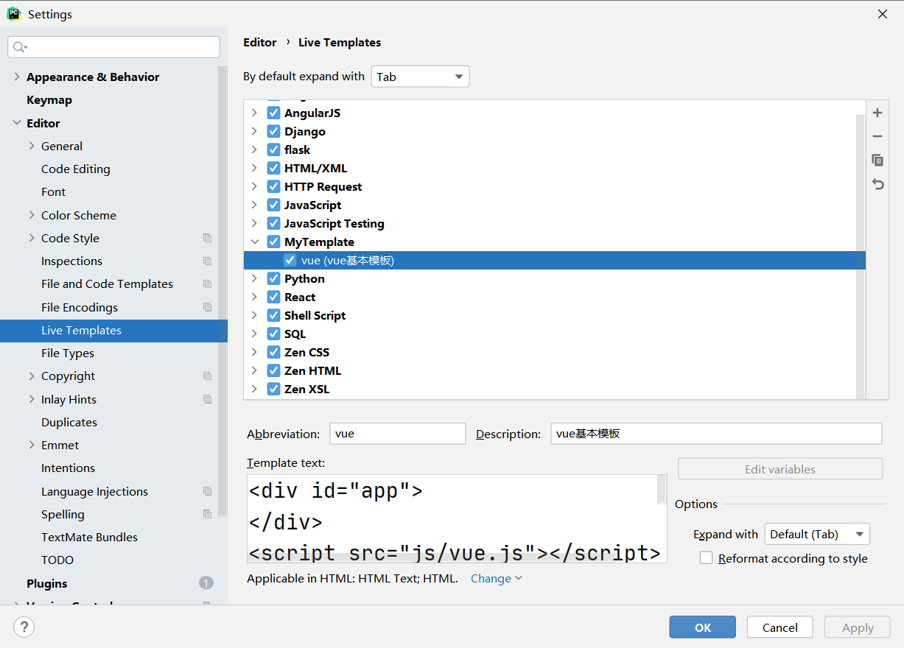
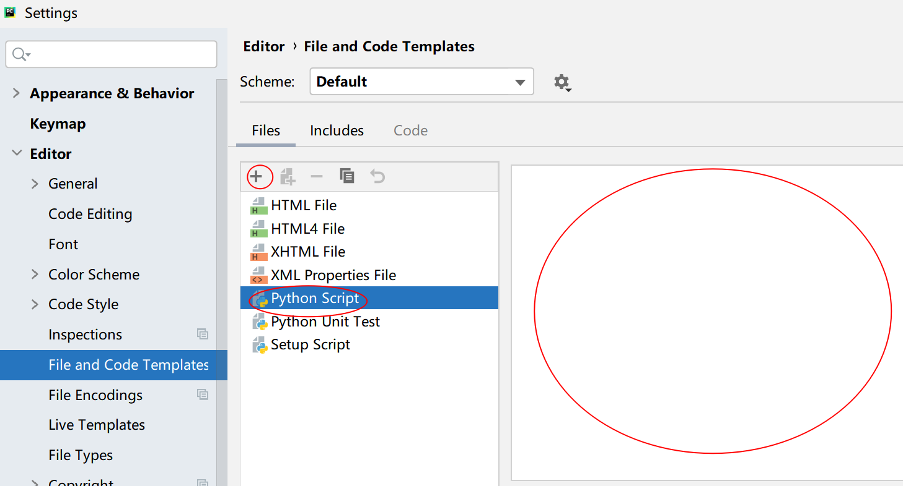

 - Live Template
	 - 在setting -> editor -> Live Template中，先添加template group，再在新添加的模板组下添加自己的模板
	 - Abbreviation为快捷键，Description为快捷键说明，Template Text为输入快捷键和tab后你希望自动补全的代码
	 - 最后选择你希望在哪种类型的文件中使用自定义快捷键
	 - 
 - File Template
	 - 在setting -> editor -> File and Code Templates中,选中现存的或者新建一种文件
	 - 
	 - 在右侧的空白处填入希望新建文件时自动填充的代码
	 - 其中预定义的模板变量有：

| Variable        | Description                 |
| --------------- | --------------------------- |
| ${DATE}         | Current system date         |
| ${DAY}          | Current day of the month    |
| ${FILE_NAME}    | Name of the new file.       |
| ${PROJECT_NAME} | Name of the current project |
| ${TIME}         | Current system time         |
| ${USER}         |  Login name of the current user   |

